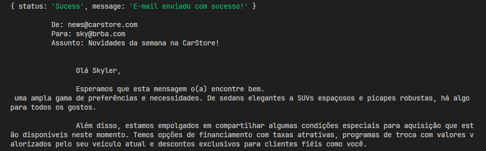
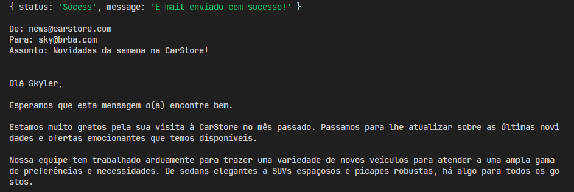

## Projeto Individual

Você foi contratado como programador para uma grande rede de lojas de automóveis (CarStore) e o seu primeiro desafio é construir a funcionalidade de enviar um e-mail, todas as segundas-feiras, para os clientes que visitaram as lojas no último mês, informando-os sobre os novos veículos e os mais vendidos, bem como as condições para aquisição (sejam criativos).

- Como não haverá acesso a banco de dados, uma lista (array) de emails deverá ser criada, onde estarão armazenados os emails dos clientes.
- A lista de emails armazenará, além do email de cada cliente, uma flag com a decisão do cliente sobre receber ou não comunicações de marketing.
- Será fornecida uma função, no arquivo "envia-email.js", que fará o envio "fake" do e-mail para um cliente.

Dado o escopo global da aplicação, pede-se desenvolver cada subtarefa visando, ao final, a entrega completa da funcionalidade:

1. Criar uma função para verificar o dia da semana atual, que será levado em conta para o disparo dos emails.

2. Criar uma função para montar o corpo do e-mail a ser enviado.

3. Criar uma função para enviar o e-mail para cada um dos clientes da lista, levando em conta a sua decisão sobre receber comunicações de marketing.

4. Tratar o retorno de erro ou sucesso da função "enviarEmail", de maneira a exibir uma mensagem amigável ao usuário no console.


### Observações

- Os passos acima são um guia, mas não obrigatórios. Podem desenvolver uma lógica diferente, que atenda ao solicitado.

- Podem separar as funcionalidades em arquivos, de acordo com a necessidade que houver.

### Alteraçoes na função ```enviaEmail()```

Foi adicionado ```.replace(/^[^\S\r\n]+/gm, '')``` ao final do ```console.log``` que mostra o email enviado. Justificativa: exibir melhor na saida do terminal ao rodar o comando:

```bash
node car-store.js
```
A seguir, uma ilustração do problema:

#### Antes do ```replace()```: 


#### Após o ```replace()```: 


## Projeto em grupo
Link do repositorio do projeto em grupo: [aqui.](https://github.com/GabrielPz/to-do-list-javascript).
